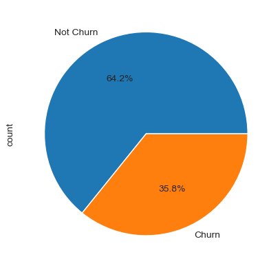
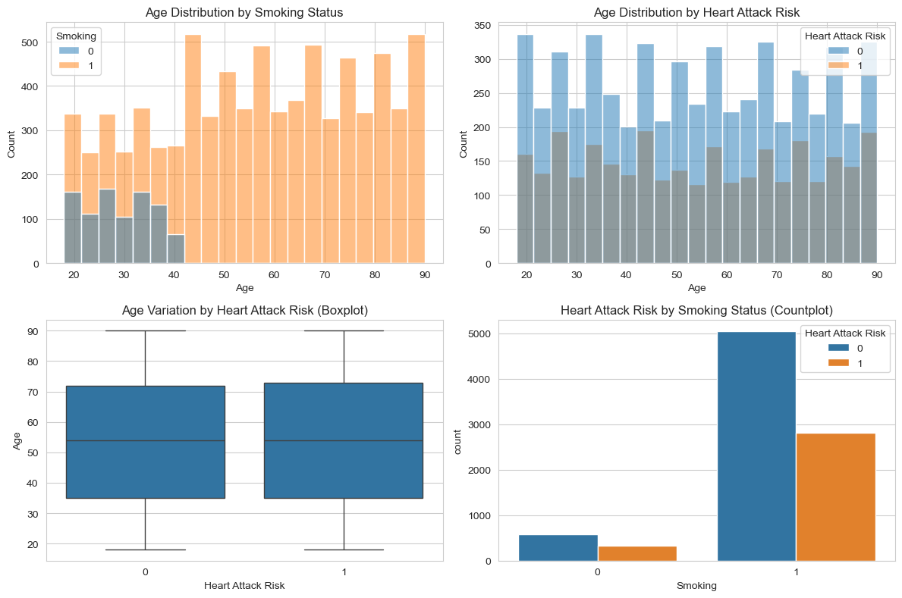
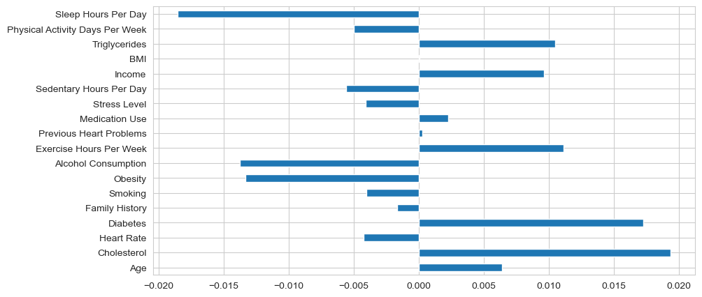
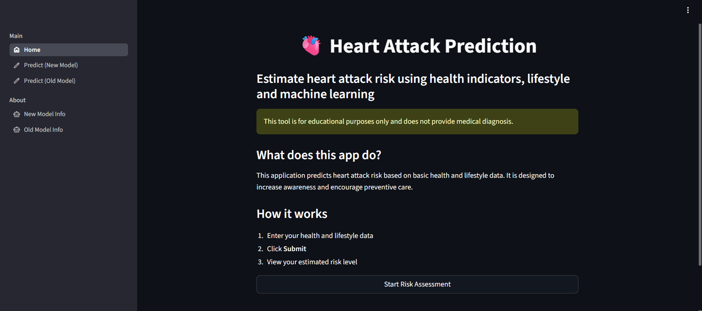
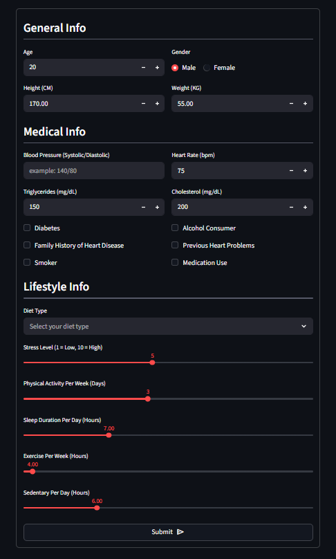
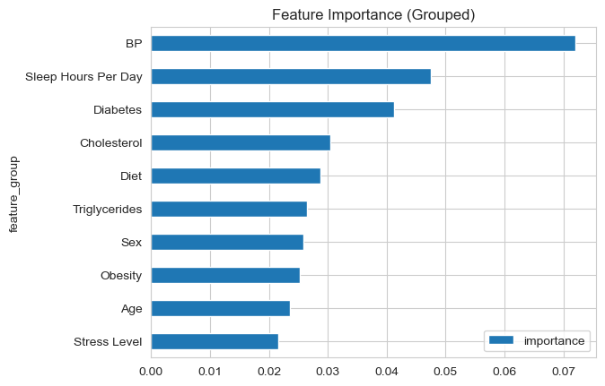
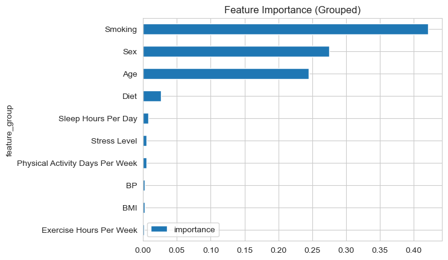

# ❤️ Heart Attack Risk Prediction  
**(Supervised vs Hybrid Clustering + Classification Approach)**

---

## 📌 Problem Statement

Heart attack risk prediction is critical in healthcare for early intervention and prevention.

This project explores two different approaches:
- Traditional **supervised learning** using clinical labels  
- A **hybrid approach** using clustering to redefine risk groups  

The goal is to evaluate how different modeling strategies impact performance and reliability.

> ⚠️ This project is designed for experimentation and learning purposes using synthetic data, with emphasis on model evaluation and pipeline correctness.

---

## 🎯 Objective

- Build baseline supervised models for heart attack risk prediction  
- Compare multiple machine learning algorithms  
- Explore clustering as an alternative way to define risk groups  
- Analyze the difference between real-label prediction and pattern-based segmentation  

---

## 📊 Dataset

The dataset used in this project is sourced from Kaggle:

🔗 https://www.kaggle.com/datasets/iamsouravbanerjee/heart-attack-prediction-dataset

### ⚠️ Important Note

- This dataset is **synthetically generated**, reportedly created using AI (ChatGPT)  
- It does **not represent real clinical patient data**  

### 🧠 Implications

- Patterns in the data may be **simplified or artificially structured**  
- Model performance may not reflect real-world medical scenarios  
- High performance (especially perfect scores) should be interpreted with caution  

---

## 🧠 Machine Learning Approaches

---

### 🔹 1. Old Model — Supervised Learning (Baseline)

**Target:** Original heart attack risk label  

#### Models Evaluated:
- Logistic Regression ✅ (Baseline Model)  
- Decision Tree  
- Random Forest  
- K-Nearest Neighbors (KNN)  
- Support Vector Machine (SVM)  
- XGBoost

#### 📊 Performance:

| Model               | ROC-AUC | Recall | Accuracy |
|--------------------|--------|--------|----------|
| Logistic Regression | ~0.50  | ~0.49  | ~0.49    |

#### ⚠️ Interpretation:
- Performance is close to **random guessing**
- Indicates:
  - Weak signal in features  
  - Non-linear relationships not captured by linear models  
  - Possible class imbalance  

#### 🧠 Insight:
Logistic Regression struggles because medical data often contains **complex, non-linear relationships**.

---

### 🔹 2. New Model — Hybrid (Clustering + Classification)

**Step 1:** Apply K-Means clustering  
**Step 2:** Replace original target with cluster labels  
**Step 3:** Train supervised models on new labels  

**Final Model:** Random Forest ✅  

---

## 📊 Model Performance (Hybrid Approach)

| Model         | ROC-AUC | Recall | Accuracy |
|--------------|--------|--------|----------|
| Random Forest | 1.00   | 1.00   | 1.00     |

---

## ⚠️ Critical Interpretation

These perfect scores are **expected and do NOT represent real predictive performance**.

### Why?

- The target variable is derived from clustering  
- The model is learning to **replicate clustering patterns**, not predict real outcomes  

---

## 🧠 Key Insight

This approach demonstrates:
- Strong separability of clusters  
- Random Forest’s ability to model complex patterns  

However:
> 🚨 This is a **circular learning problem**, not a real-world prediction task

---

## 📊 Visualizations & Insights

### 📊 Data Analysis

#### Target Distribution


#### Age Distribution & Smoking


#### Target Correlation


---

### 📊 Dashboard


### 🤖 Prediction Page


---

### 📈 Feature Importance (Old Model)


### 📈 Feature Importance (New Model)


---

## ⚖️ Comparison Summary

| Aspect                | Supervised | Hybrid |
|----------------------|------------|--------|
| Target               | Real       | Cluster |
| Performance          | Low        | Perfect |
| Real-world validity  | ✅ Yes     | ❌ No |
| Complexity           | Low        | High |
---

## 📈 Key Takeaways

- Logistic Regression fails → suggests **non-linear patterns exist**  
- Random Forest performs well → captures complex feature interactions  
- Clustering reveals hidden structure in data  
- But using cluster labels creates **artificial performance inflation**  

---

## 🖥️ Streamlit App Features

- 🧾 User input form for patient data  
- 🤖 Real-time prediction  
- 📊 Dataset and Model Selection Information  

---

## 🚀 How to Run the Project

### 1. Clone Repository

```bash
git clone https://github.com/Eusford08/HeartAttackRisk.git
cd HeartAttackRisk
```

### 2. Install Dependencies

```bash
pip install -r requirements.txt
```

### 3. Run Streamlit App

```bash
streamlit run app.py
```

---

## ⚠️ Limitations

- Synthetic dataset limits real-world applicability  
- Hybrid model uses **artificial target (cluster labels)**  
- Results are **not generalizable to real-world medical prediction**  
- Potential lack of true medical complexity and noise  

---

## 🚀 Future Improvements

- Use real-world labeled medical datasets  

---

## 🔧 Tech Stack

- Python
- Pandas / NumPy
- Scikit-learn
- Imbalanced-learn (SMOTE)
- XGBoost
- Matplotlib / Seaborn
- Streamlit
---

## 👤 Author

**Jackson Lee**  
Data Science & Machine Learning Practitioner  

---

## ⭐ Highlight

This project demonstrates:
- Understanding of **model limitations**  
- Awareness of **data leakage and circular learning**  
- Ability to critically evaluate machine learning pipelines  

---